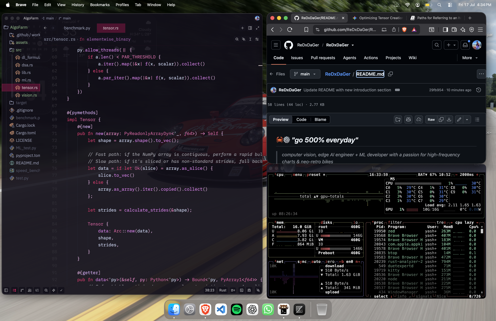

  

## 🦀⚙️ *"go 500% everyday"*

> <i>computer vision, edge AI engineer + ML developer with a passion for high-frequency charts & neo-retro bikes</i>

I optimize real-time deep learning pipelines and deploy computer vision systems on low-power edge hardware. The objective is to design hyper-lightweight, high-throughput model architectures running at maximum physical frame rates. 🦀⚙️

  
  

---

## XP
*Detailed writeups on optimizing models, Quantization-Aware Training (QAT), and TensorRT execution are hosted directly on my repositories.*

<table>
  <thead>
    <tr>
      <th>Role</th>
      <th>Company/Institution</th>
      <th>Location</th>
      <th>Dates</th>
    </tr>
  </thead>
  <tbody>
    <tr>
      <td><b>Data Science Intern</b></td>
      <td>IIT Madras</td>
      <td>Chennai, India</td>
      <td>Dec 2024 - May 2025</td>
    </tr>
    <tr>
      <td><b>AI Development Intern</b></td>
      <td>SkyGad</td>
      <td>Remote</td>
      <td>Aug 2024 - Dec 2024</td>
    </tr>
  </tbody>
</table>

---

### Featured Deployments & Projects

*   **⚡ Real-Time Traffic & Surveillance Pipeline (IIT Madras):** Deployed directional-aware YOLOv5/v8 object detection on NVIDIA Jetson systems. Compressed layers via TensorRT to maintain high real-time throughput. Integrated Annoy-based access tracking and automated reporting mechanisms.
*   **👁️ Face Recognition & Temporal Tracking System:** Real-time facial validation linking YOLOv8, ByteTrack, and ArcFace embeddings queried against a dynamic FAISS index. Stabilized with temporal label smoothing across video sequences.
*   **🤖 RAVA (Retrieval-Augmented Virtual Assistant):** Memory-enabled conversational agent utilizing LangGraph, Google Gemini API, and Annoy index indexing for per-user localized context.
*   **📐 NumPy Feedforward Neural Network (CS6910):** Built a deep feedforward network from absolute scratch (zero PyTorch/TF autodiff). Custom-implemented 6 optimizers (SGD, Adam, Nadam, RMSProp) and used WandB sweeps to benchmark Fashion-MNIST accuracy.

---

### Community & Engagement

*   **Google Developer Student Club (GDSC) IIT Madras** — Core Team Member & Technical Speaker ("Git and GitHub", "Dumping of Windows").
*   **Linux Community Lead** — IIT Madras.
*   **Al Horizons Conference** — Co-organized academic AI horizons forum alongside Prof. Sudarshan Iyengar.
*   **Smart India Hackathon** — Runner-up (2023).
